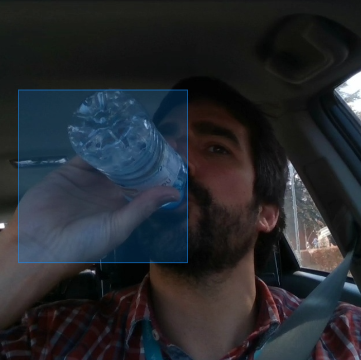
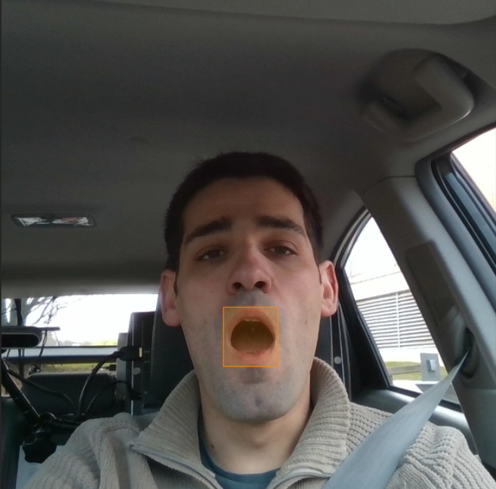
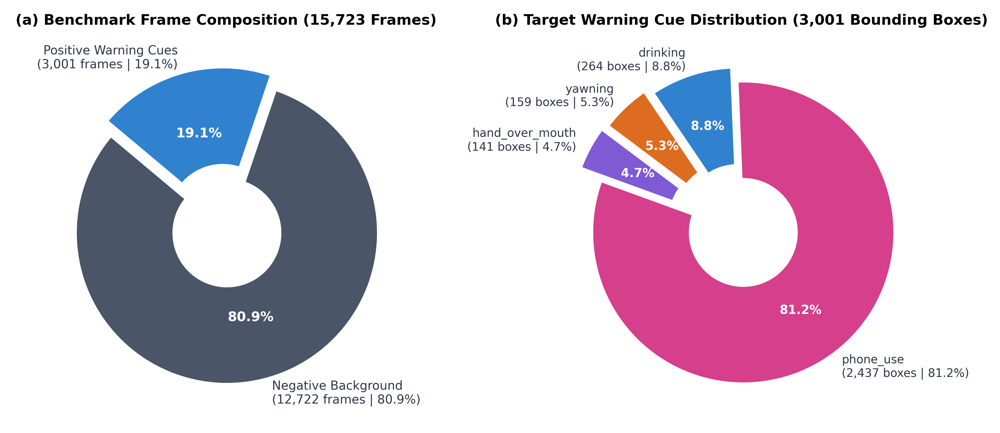
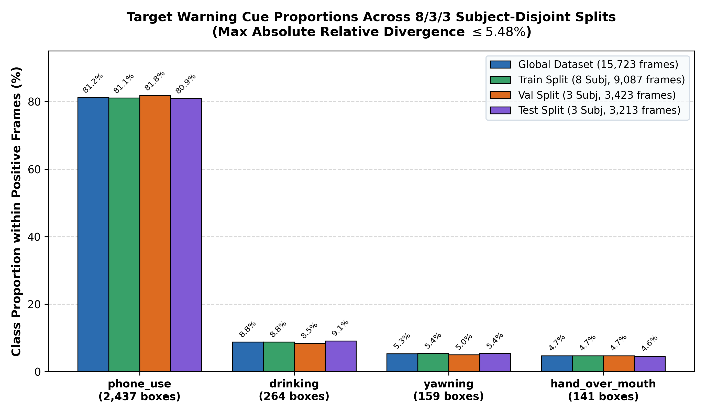
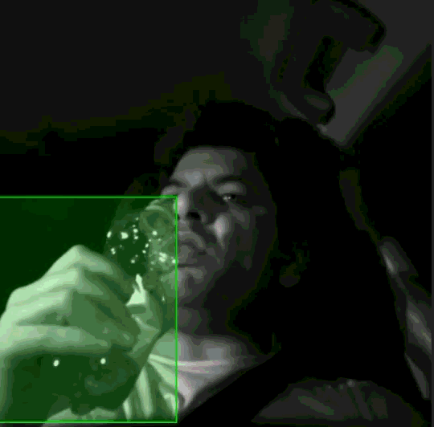
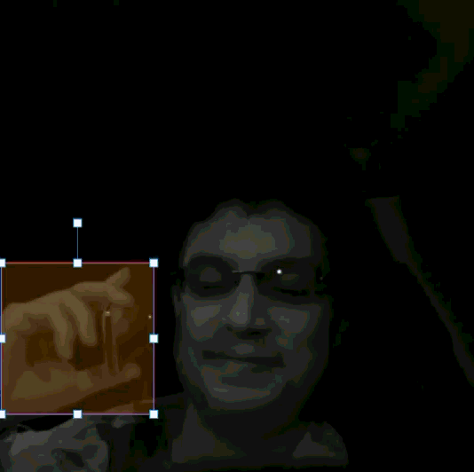
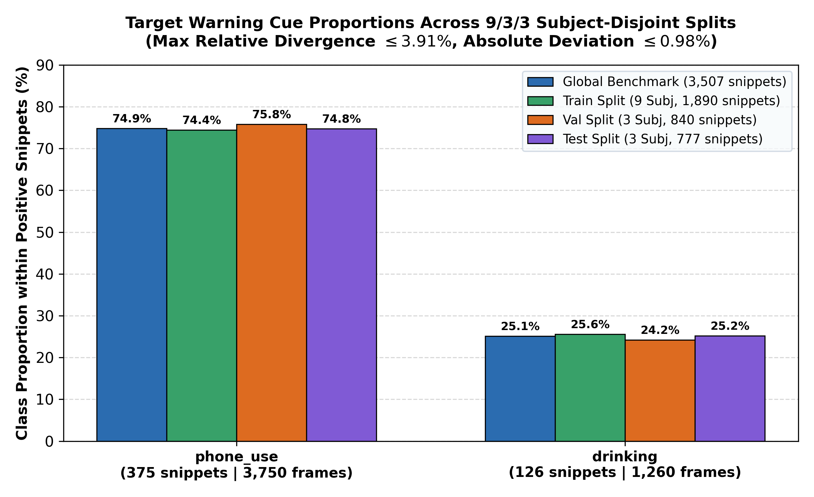

# Methodology

[← Back to Main README](../README.md)

## Unified Evaluation Protocol

> [!CAUTION]
> RGB is the primary subject-disjoint benchmark. NIR is a separate exploratory experiment; ontology, sampling, run identity, and source data remain track-specific, so the two sections do not estimate a controlled spectral effect.

| Parameter / Shared Element | Frozen Specification | Notes |
| :---: | :---: | :---: |
| **Models** | YOLO11n, YOLO26n, D-FINE-N | Complete released nano systems with native recipes |
| **Input Resolution** | 640 × 640 px | All models and tracks |
| **Physical Batch Size** | 8 | Per iteration |
| **Gradient Accumulation** | 4 steps | Effective batch size 32 |
| **Training Budget** | 220 epochs | Early stopping disabled |
| **Optimization** | Pinned model-native recipe | YOLO uses `optimizer=auto`, linear schedule, `cos_lr=false`; D-FINE uses AdamW/MultiStepLR |
| **Evaluation** | COCO mAP and validation-calibrated operating point | Test is never used for tuning |
| **Profiling** | Batch 1, 640 × 640, CUDA AMP FP16 | RTX 4060 values are hardware-specific |

The fixed accumulation patches normalize the final incomplete window by its actual sample count. Every image is therefore retained without giving a short last window disproportionate gradient weight. External package versions, upstream commit, weight checksums, and patch files are frozen in `configs/backends.yaml`.

### Validation and Protected Test Policy

Training and validation are separate operations. Model-native validation selects the best retained checkpoint; the separate validation phase calibrates confidence threshold $\tau^* \in [0.01, 0.99]$ by micro-F1, with higher precision and then higher threshold as tie-breakers. A frozen validation manifest records the checkpoint, dataset, and prediction checksums before test access. The user must then explicitly confirm the single protected test pass; an append-only local sentinel prevents an accidental rerun. Training retains best/last checkpoints and sparse 100-epoch D-FINE milestones instead of per-epoch archives.

| Category | Reported Metric |
| :---: | :---: |
| **Detection** | mAP@0.5:0.95, mAP@0.5, per-class AP |
| **Operating Point** | Precision, recall, micro/macro-F1, false detections per 100 negative frames |
| **Runtime** | Model-forward and tensor-to-detections p50/p95/p99, sustained FPS |
| **Resources** | Parameters, FLOP estimates, peak allocated VRAM, local checkpoint size |

## RGB Evaluation Protocol

<p align="center">
  
  <br>
  
  <br>
  <sub><b>Figure 1.</b> Manual RGB annotations for the four warning cues.</sub>
</p>

### Dataset and Subject-Disjoint Partitioning

The RGB track contains 15,723 cropped `640×640` frames sampled at 1 FPS from 81 driver-facing [DMD](https://dmd.vicomtech.org/) recordings across 14 subjects. It localizes four discrete, momentary visual cues: `yawning`, `hand_over_mouth`, `drinking`, and `phone_use`. This single-frame task does not infer temporal fatigue, intent, or driver state. The 3,001 positive frames and 12,722 naturalistic negatives produce a negative-heavy continuous benchmark.

One primary annotator labeled the dataset in one pass; no independent second-person review was established. The frozen spatial definitions are:

- `yawning`: tightly enclose the visible mouth.
- `hand_over_mouth`: enclose the full visible face and hand covering the mouth.
- `phone_use`: enclose the visible hand–phone interaction.
- `drinking`: enclose the visible hand/container–mouth interaction.

Every sampled frame is retained and contains zero or one box. Cues are mutually exclusive; `hand_over_mouth` takes precedence when a covering hand occludes a yawn. Boxes include only visible evidence and never extrapolate hidden or out-of-frame anatomy. Partial or boundary-truncated cues remain valid when visually identifiable, and no arbitrary minimum pixel cutoff is used. An automated structural audit found zero duplicate IDs/file names, orphan annotations, invalid categories, nonfinite/nonpositive/out-of-bounds boxes, or multi-annotation frames. This audit does not establish semantic agreement.

<p align="center">
  <br>
  <sub><b>Figure 2.</b> RGB frame composition and positive-class distribution.</sub>
</p>

The exhaustive $8:3:3$ subject assignment yields 9,087 train, 3,423 validation, and 3,213 test frames. The selected partition minimizes worst relative distribution deviation with RMSE as tie-breaker. Subject identities and native validation/test order are frozen in `data/annotations/RGB/splits.json`; the master COCO file is `data/annotations/RGB/annotations.json`.

<p align="center">
  <br>
  <sub><b>Figure 3.</b> Cue proportions across the RGB subject-disjoint splits.</sub>
</p>

### Multi-Seed Training

Each architecture uses the predeclared seeds 13, 37, and 73. Only training order and stochastic optimization differ; validation and test membership/order remain fixed. All three seed results are reported as sample mean ± sample standard deviation:

```math
\bar{x}=\frac{1}{3}\sum_{i=1}^{3}x_i,\qquad
s=\sqrt{\frac{1}{2}\sum_{i=1}^{3}(x_i-\bar{x})^2}.
```

The sample SD measures optimization variability on this one fixed subject split; it is not an uncertainty interval for generalization across held-out drivers. Class and subject operating metrics and paired model differences are therefore also reported from frozen prediction files.

YOLO26 uses its pinned end-to-end one-to-one prediction path without external NMS; YOLO11n uses its conventional NMS path. Postprocessing and native optimization are part of the released system comparison rather than controlled architecture-only variables.

## Near-Infrared (NIR) Evaluation Protocol

<p align="center">
  
  <br>
  <sub><b>Figure 4.</b> Manual NIR tracklets for the two warning cues.</sub>
</p>

### Dataset and Temporal Sampling

The source pool contains 3,786 one-second snippets from 30 driver-facing active-NIR ($850\text{ nm}$) [Drive&Act](https://driveandact.com/) streams across 15 subjects. Twenty-three unilluminated task snippets are excluded before splitting, leaving 3,763. Each selected snippet contributes exactly one frame at 1 FPS. The sample is the frozen temporal midpoint at $t=0.5$ s, corresponding to zero-based source-frame offset 14 in each 30-frame snippet. Its target box is obtained by linear interpolation of the Label Studio tracklet at the same time. Frames are cropped from `[128:1152, 0:1024]` and resized to `640×640`.

The ontology is limited to `drinking` and `phone_use`. The $9:3:3$ subject partition is frozen as:

- Train: 9 subjects, 270 positive snippets.
- Validation: 3 subjects, 120 positives + 761 negatives = 881 snippets / 881 frames.
- Test: 3 subjects, 111 positives + 739 negatives = 850 snippets / 850 frames.

<p align="center">
  <br>
  <sub><b>Figure 5.</b> Cue proportions across the NIR subject-disjoint splits.</sub>
</p>

### Training-Negative Exposure Conditions

NIR uses one seed—13—and two conditions. There is no NIR multi-seed experiment and no 1:3 condition.

| Condition | Train Positives | Train Negatives | Train Snippets / Frames | Full Condition Snippets / Frames |
| --- | ---: | ---: | ---: | ---: |
| **1:2** | 270 | 540 | 810 / 810 | 2,541 / 2,541 |
| **1:6** | 270 | 1,620 | 1,890 / 1,890 | 3,621 / 3,621 |

Only the training negatives change. The 1:2 negatives are a subject-stratified, seed-13 deterministic subset of the 1:6 negative pool. The positive training pool, validation tasks, test tasks, temporal sampling, ontology, model recipes, and metric code are identical across both ratios. Derived validation/test COCO and YOLO files are physically shared under `data/processed/NIR/*/evaluation` to prevent silent drift.

Because epochs are fixed, 1:6 contains three times the unique training negatives and approximately three times the optimization steps. This is a training-negative exposure study, not a causal ratio ablation under matched training signal. At one frame per snippet, frame- and snippet-level operating decisions are identical; the publication therefore reports COCO AP, micro/macro-F1, and false detections per 100 negative frames without duplicating equivalent snippet metrics.

## Reproducibility and Data Availability

Published authored annotations and split metadata live under `data/annotations`. Licensed DMD and Drive&Act media are not redistributed: users place them under `data/DMD` and `data/Drive&Act`, then run the numbered BAT files under `scripts/data`. Generated frames, backend downloads, checkpoints, predictions, and logs are ignored under `data/processed`, `third_party`, and `runs`.

> [!TIP]
> `scripts/preflight.bat` checks repository integrity without the GPU. The two dataset-check BAT files additionally verify every prepared frame and frozen split count.
