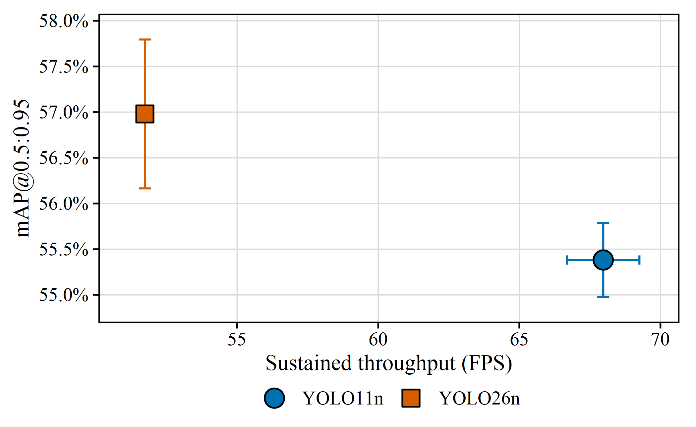
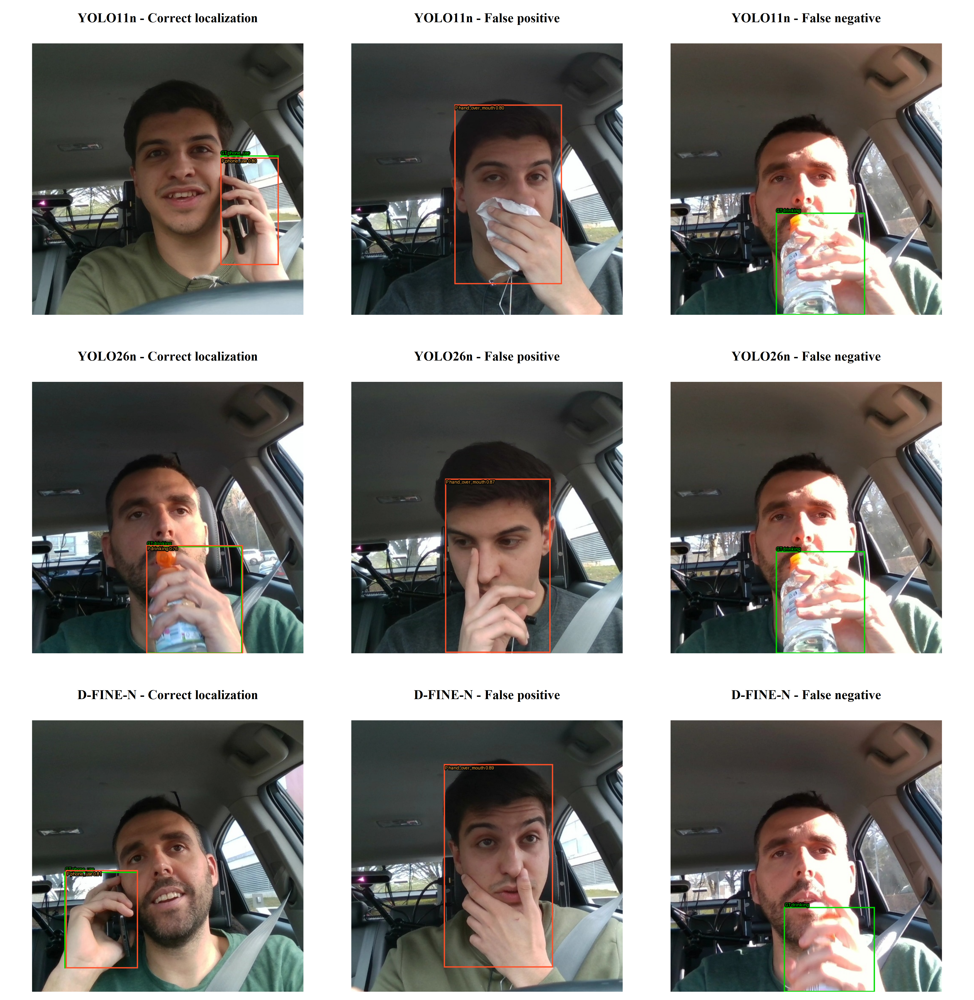
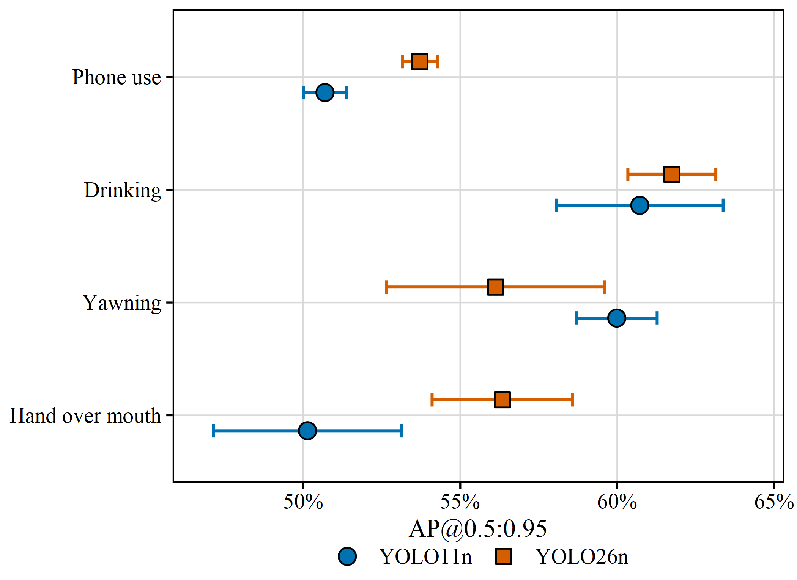

# Results

[← Back to Main README](../README.md)

> [!IMPORTANT]
> All nine RGB protected passes and all six frozen NIR protected passes are complete. The D-FINE-N RGB result is frozen separately because the six earlier YOLO passes retain their original suite ID.

## RGB Summary

YOLO11n achieves the highest mAP@0.5 and sustained throughput. YOLO26n achieves the highest stricter mAP@0.5:0.95 while using the fewest parameters and estimated FLOPs. D-FINE-N achieves the highest recall and micro/macro-F1, but is the slowest system. Values are sample mean ± sample standard deviation over seeds 13, 37, and 73; this SD measures optimization variability on one fixed subject split, not held-out-driver uncertainty.

### Overall Detection Performance

| Model | Runs | mAP@0.5:0.95 (↑) | mAP@0.5 (↑) | Precision (↑) | Recall (↑) | Micro-F1 (↑) | Macro-F1 (↑) | False Det./100 Neg. Frames (↓) |
| --- | --- | --- | --- | --- | --- | --- | --- | --- |
| **YOLO11n** | 3 | 0.5538 ± 0.0041 | **0.9179 ± 0.0044** | **0.9343 ± 0.0116** | **0.8073 ± 0.0170** | **0.8660 ± 0.0049** | **0.8342 ± 0.0136** | **0.63 ± 0.04** |
| **YOLO26n** | 3 | **0.5698 ± 0.0081** | 0.8928 ± 0.0099 | 0.9256 ± 0.0112 | 0.7763 ± 0.0124 | 0.8444 ± 0.0114 | 0.7939 ± 0.0149 | 0.67 ± 0.06 |
| **D-FINE-N** | 3 | 0.5538 ± 0.0089 | 0.9022 ± 0.0229 | 0.9288 ± 0.0338 | **0.8947 ± 0.0199** | **0.9114 ± 0.0266** | **0.8433 ± 0.0451** | 0.87 ± 0.21 |

False detections per 100 negative frames is a static per-frame count. It is not a modeled alert rate because no temporal confirmation or debouncing is applied.

   
  <b>Figure 1.</b> RGB accuracy–speed trade-off on the RTX 4060 benchmark system. Error bars are sample SD; marker area represents serialized model size.

### Paired-Seed and Subject Analysis

Across all three paired seeds, YOLO11n is higher in mAP@0.5, micro/macro-F1, and throughput, while YOLO26n is higher in mAP@0.5:0.95. Per-class AP has a consistent YOLO11n direction for `yawning`, consistent YOLO26n directions for `hand_over_mouth` and `phone_use`, and no consistent direction for `drinking`.

Mean subject-level micro-F1 for the three fixed test drivers is 0.9494, 0.6241, and 0.9472 for YOLO11n and 0.9611, 0.5411, and 0.9229 for YOLO26n. This variation is descriptive and shows why seed SD cannot be interpreted as uncertainty over unseen drivers.

   
  <b>Figure 2.</b> Seed-13 true-positive, false-detection, and false-negative examples. The cue-like nominal negative is retained because it exposes semantic annotation uncertainty.

### Inference Efficiency

| Model | Model Fwd (ms) (↓) | Tensor→Det (ms) (↓) | Sustained FPS (↑) | Params (M) (↓) | GFLOPs (↓) |
| --- | --- | --- | --- | --- | --- |
| **YOLO11n** | **13.46 ± 0.20** | **14.30 ± 0.20** | **68.0 ± 1.3** | 2.59 | 6.44 |
| **YOLO26n** | 18.88 ± 0.10 | 19.21 ± 0.09 | 51.7 ± 0.2 | **2.51** | **5.78** |
| **D-FINE-N** | 21.29 ± 0.45 | 23.31 ± 0.46 | 40.4 ± 1.2 | 3.72 | 7.44 |

Latency excludes disk I/O, decode, preprocessing, and metric computation. It includes the frozen batch-1 CUDA AMP FP16 boundaries described in [methodology.md](./methodology.md).

### Per-Class Average Precision

| Model | AP Yawning (↑) | AP Hand Over Mouth (↑) | AP Drinking (↑) | AP Phone Use (↑) |
| --- | --- | --- | --- | --- |
| **YOLO11n** | **0.5998 ± 0.0129** | 0.5013 ± 0.0300 | 0.6072 ± 0.0266 | 0.5069 ± 0.0069 |
| **YOLO26n** | 0.5613 ± 0.0348 | **0.5634 ± 0.0224** | **0.6174 ± 0.0140** | **0.5371 ± 0.0055** |
| **D-FINE-N** | **0.6150 ± 0.0052** | 0.3734 ± 0.0159 | **0.6512 ± 0.0066** | **0.5756 ± 0.0178** |

   
  <b>Figure 3.</b> RGB AP@0.5:0.95 by warning cue, mean ± sample SD.

Machine-readable YOLO values are in [`results/RGB/summary`](../results/RGB/summary/README.md), and D-FINE-N metrics and hashes are in [`results/RGB/dfine_n/training_runs.json`](../results/RGB/dfine_n/training_runs.json). Qualitative analyses for the historical YOLO suite are organized under `results/RGB/{model}/seed_{13,37,73}`.

> [!NOTE]
> D-FINE-N was added after the original six-run YOLO suite had already crossed its protected-test gate. Its checkpoints and thresholds were frozen without test feedback, and its three passes are valid under the expanded nine-run suite. A single combined nine-run aggregate is not claimed because the suite IDs differ.

## NIR Benchmark

All values below are from the seed-13 protected test split after validation-only threshold selection. Macro-F1 is the stored class-presence localization metric; micro-F1 and false detections retain their detection-level definitions. Tensor-to-final latency is batch-1 CUDA AMP FP16 on the RTX 4060 and excludes input/output, decoding, and preprocessing.

| Model | Train Pos:Neg | mAP@0.5:0.95 | Micro-F1 | Macro-F1 | False Det./100 Neg. Frames | Tensor→Det. p50 (ms) |
| --- | --- | ---: | ---: | ---: | ---: | ---: |
| YOLO11n | 1:2 | 0.4262 | 0.7191 | 0.6194 | 0.14 | 15.22 |
| YOLO11n | 1:6 | 0.3707 | 0.6915 | 0.7032 | 0.41 | 13.74 |
| YOLO26n | 1:2 | 0.3575 | 0.7654 | 0.8362 | 2.17 | 17.11 |
| YOLO26n | 1:6 | 0.4128 | 0.6596 | 0.6557 | 0.68 | 16.84 |
| D-FINE-N | 1:2 | **0.4638** | **0.8358** | 0.8025 | 0.54 | 24.58 |
| D-FINE-N | 1:6 | **0.4630** | **0.7923** | 0.7645 | 0.81 | 24.10 |

Increasing negative exposure does not have a uniform strict-IoU effect and lowers micro-F1 for all three systems. These are within-model exposure comparisons, not a controlled RGB-versus-NIR modality comparison.

> [!NOTE]
> Within each NIR figure panel, a thick red segment spans each ratio section at the arithmetic mean of its three models.
